<p align="center">
  
</p>

<p align="center">
  <a href="https://github.com/Nicsilver/commit-arcade/actions/workflows/ci.yml"></a>
  
  
</p>

<p align="center">
  <b>Your GitHub contribution graph, played as a classic arcade game.</b><br>
  Ten games, rendered as animated SVGs for your profile README.
</p>

<p align="center">
  <a href="#insert-coin">Insert coin</a> ·
  <a href="#the-games">The games</a> ·
  <a href="#options">Options</a> ·
  <a href="#how-it-works">How it works</a>
</p>

<br>

<p align="center">
  
</p>
<p align="center"><sub>Today's game on my graph, in the <code>neon</code> theme.</sub></p>

## Insert coin

Everything runs in GitHub Actions in your profile repo.

1. Create `.github/workflows/arcade.yml` in your profile repo (the one named after your username):

```yaml
name: Arcade

on:
  schedule:
    - cron: "0 3 * * *"
  workflow_dispatch:

permissions:
  contents: write

jobs:
  arcade:
    runs-on: ubuntu-latest
    steps:
      - uses: Nicsilver/commit-arcade@v1
        with:
          outputs: |
            dist/arcade.svg?game=daily&theme=github-dark
            dist/arcade-light.svg?game=daily&theme=github-light

      - uses: crazy-max/ghaction-github-pages@v4
        with:
          target_branch: output
          build_dir: dist
        env:
          GITHUB_TOKEN: ${{ secrets.GITHUB_TOKEN }}
```

2. Run it once from the Actions tab (it also runs every night after that).

3. Add this to your `README.md`, with your username:

```html
<picture>
  <source media="(prefers-color-scheme: dark)" srcset="https://raw.githubusercontent.com/YOUR_NAME/YOUR_NAME/output/arcade.svg">
  
</picture>
```

Want the same game every day instead of a rotation? Swap `game=daily` for one game: `snake`, `pacman`, `breakout`, `invaders`, `asteroids`, `tetris`, `bomberman`, `galaga`, `centipede`, `tron`. You can list as many outputs as you like.

## The games

Each game plays until your graph is cleared. The score counts your contributions as they go.

### 01 · Snake <sub><code>game=snake</code></sub>

The snake eats your contributions and grows with each one. Body segments keep the colour of the day they came from.

<picture>
  <source media="(prefers-color-scheme: dark)" srcset="https://raw.githubusercontent.com/Nicsilver/commit-arcade/output/snake.svg">
  
</picture>

### 02 · Pac-Man <sub><code>game=pacman</code></sub>

Pac-Man clears the graph while the four ghosts chase him. Power pellets sit in the corners and the maze flashes when the board is clear.

<picture>
  <source media="(prefers-color-scheme: dark)" srcset="https://raw.githubusercontent.com/Nicsilver/commit-arcade/output/pacman.svg">
  
</picture>

### 03 · Breakout <sub><code>game=breakout</code></sub>

Your days are the bricks. Busy days take two hits, and a fireball takes over for the last third.

<picture>
  <source media="(prefers-color-scheme: dark)" srcset="https://raw.githubusercontent.com/Nicsilver/commit-arcade/output/breakout.svg">
  
</picture>

### 04 · Space Invaders <sub><code>game=invaders</code></sub>

Every contribution is an invader marching in formation, with bunkers, bombs and the mystery ship.

<picture>
  <source media="(prefers-color-scheme: dark)" srcset="https://raw.githubusercontent.com/Nicsilver/commit-arcade/output/invaders.svg">
  
</picture>

### 05 · Asteroids <sub><code>game=asteroids</code></sub>

The ship shoots your graph apart. Busy days split into drifting rocks first, and a flying saucer crosses once.

<picture>
  <source media="(prefers-color-scheme: dark)" srcset="https://raw.githubusercontent.com/Nicsilver/commit-arcade/output/asteroids.svg">
  
</picture>

### 06 · Tetris <sub><code>game=tetris</code></sub>

Your graph settles into a stack, tetrominoes fill the gaps and the lines sweep away. It finishes on a Tetris when the board allows it.

<picture>
  <source media="(prefers-color-scheme: dark)" srcset="https://raw.githubusercontent.com/Nicsilver/commit-arcade/output/tetris.svg">
  
</picture>

### 07 · Bomberman <sub><code>game=bomberman</code></sub>

Days are soft blocks. Bomberman plants bombs, gets out of the way and picks up power-ups.

<picture>
  <source media="(prefers-color-scheme: dark)" srcset="https://raw.githubusercontent.com/Nicsilver/commit-arcade/output/bomberman.svg">
  
</picture>

### 08 · Galaga <sub><code>game=galaga</code></sub>

Your days are the enemy formation, with dive attacks, the tractor beam and the dual fighter.

<picture>
  <source media="(prefers-color-scheme: dark)" srcset="https://raw.githubusercontent.com/Nicsilver/commit-arcade/output/galaga.svg">
  
</picture>

### 09 · Centipede <sub><code>game=centipede</code></sub>

Your contributions are the mushroom field. Shoot the centipede and it splits, leaving new mushrooms behind. The flea and the spider show up too.

<picture>
  <source media="(prefers-color-scheme: dark)" srcset="https://raw.githubusercontent.com/Nicsilver/commit-arcade/output/centipede.svg">
  
</picture>

### 10 · Tron <sub><code>game=tron</code></sub>

Two light cycles race for your days and derez the ones they ride over. One of them crashes at the end.

<picture>
  <source media="(prefers-color-scheme: dark)" srcset="https://raw.githubusercontent.com/Nicsilver/commit-arcade/output/tron.svg">
  
</picture>

### Neon <sub><code>theme=neon</code></sub>

Any game with its own dark background and a stronger glow, like the one at the top. The `github-dark` and `github-light` themes use GitHub's own colours and a transparent background.

`game=daily` picks a different game each day.

## Options

Each output line is a file path followed by options:

```
dist/arcade.svg?game=pacman&theme=neon&accent=#ff4df0
```

| Option | Values | Default |
| --- | --- | --- |
| `game` | `snake`, `pacman`, `breakout`, `invaders`, `asteroids`, `tetris`, `bomberman`, `galaga`, `centipede`, `tron`, `daily` | `snake` |
| `theme` | `github-dark`, `github-light`, `neon` | `github-dark` |
| `background` | a colour, or `none` for transparent | from theme |
| `empty` | colour of days without contributions | from theme |
| `levels` | four comma-separated colours, light to heavy | from theme |
| `sprites` | four comma-separated colours for sprites made from days | follows `levels` |
| `ink`, `muted`, `accent`, `surface` | colours for text, the player and banners | from theme |

Action inputs:

| Input | Default |
| --- | --- |
| `outputs` | required |
| `github_user_name` | the repository owner |
| `github_token` | `${{ github.token }}` |

## Run it locally

```sh
git clone https://github.com/Nicsilver/commit-arcade
cd commit-arcade
GITHUB_TOKEN=... node dist/cli.js --user YOUR_NAME --game all --out preview
node dist/cli.js --sample --game pacman --theme neon --out preview
```

No dependencies at runtime. Node 22.18 or newer.

## How it works

Each game is simulated on your graph first. The simulation records when every sprite moves, and that is written out as CSS keyframes in an SVG. There's no JavaScript in the image, so GitHub shows it like any other picture.

The score counts your contributions as the game clears them, so it ends on your total for the year.

The same graph always plays out the same way, so the image only changes when your contributions do.

## Development

```sh
npm ci
npm test
npm run demo     # renders every game on a sample graph into demo/
npm run build    # bundles dist/, which the action runs from
```

Inspired by [Platane/snk](https://github.com/Platane/snk).

## License

MIT
